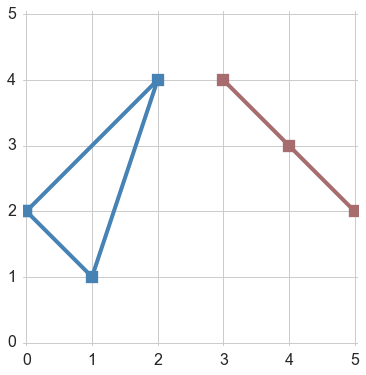
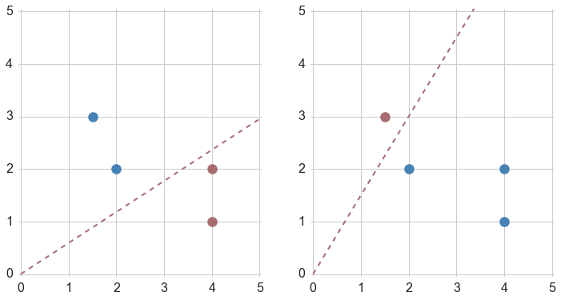
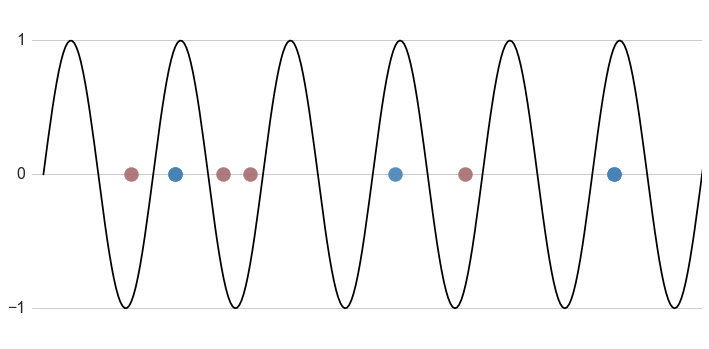

Learnability
=

Due: 14. October at 11:55pm 

Overview
--------
In this assignment you will explore the concepts of PAC learning and VC dimension.  This assignment is mostly 
analysis with one small programming task. 

You'll turn in your code and analysis on Moodle.  This assignment is worth 25
points.

Problem 1
---

Consider the class C of concepts defined by triangles with distinct vertices of the form (i, j) where i and j 
are integers in the interval [0,99].  A concept c labels points on the interior and boundary of a triangle 
as positive and points on the exterior of the triangle as negative. 

Give a bound on the number of randomly drawn training examples sufficient to assure that for any target class
c in C, any consistent learner will, with probability 95%, output a hypothesis with error at most 0.15.  

**Note**: To make life easier, we'll allow degenerate triangles in C.  That is, triangles where the vertices
are collinear.  The following image depicts an example of a degenerate and nondegenerate triangle. 

Problem 2
---

State and prove the VC Dimension of the hypothesis class H of linear hyperplanes in 2D that pass through the 
origin.  To prove your lower bound on the VC Dimension you should give an example of a configuration of points
that can be shattered by H.  You should prove your upper bound on the VC Dimension by a rigorous-ish mathematical
argument.  

**Hint**:  If you represent the decision boundary in a clever way you can use an argument very similar to the one 
we used in the intervals example given in the lecture slides. 

Problem 3
---

Consider the case of classifying 1D points on the real line with the set of hypotheses of the following form  

For a given value of w, the hypothesis classifies points as positive if they lie on or above the sine curve 
and negative if they lie below the sine curve. 

It turns out that the VC Dimension of this hypothesis class is infinite.  In other words, for **any** number
of training examples there exists a configuration of points which can be shattered by the sine functions.  You will prove this fact by construction, by completing the code in *vc_sin.py* to determine the parameter
w that perfectly classifies a given training set.  In addition to completing the code you should clearly describe your 
solution technique in your analysis.  To make things easier (you'll have to do some thinking as to why this makes things easier) we've set up the code so that the training points are of the form x = 2**(-k) where k is a nonnegative integer. 

 

What you have to do
----

Analysis (20pts):

1.  Answer the questions posed in the problems above.   

Coding (5pts):

1.  Complete the implementation of the *train_sin_classifier* function in *vc_sin.py* 

What to turn in
-

1.  Submit your *vc_sin.py* file
1.  Submit your _analysis.pdf_ file.  There is no page limit on your write-up this time, but for Karthik's sake please make your 
well-justified arguments as concise as possible. 

Unit Tests
=

In addition to making sure that your code passes the unit tests, make sure you clearly describe why your method works in your written analysis. 

